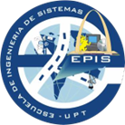
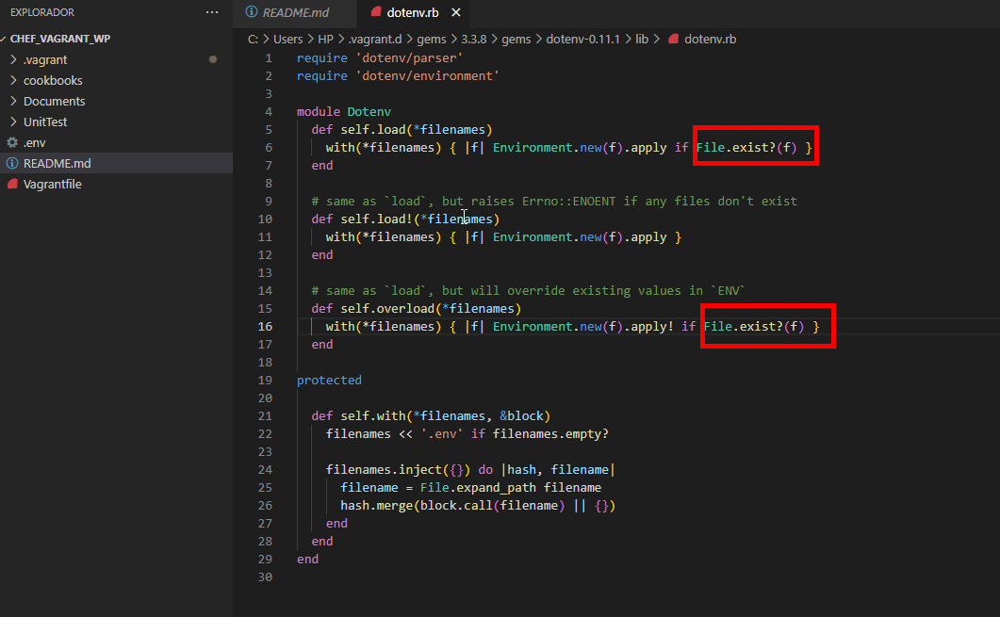
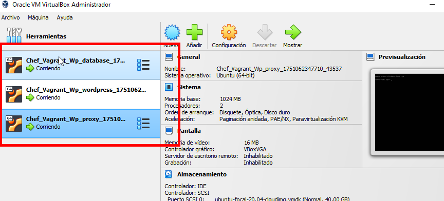
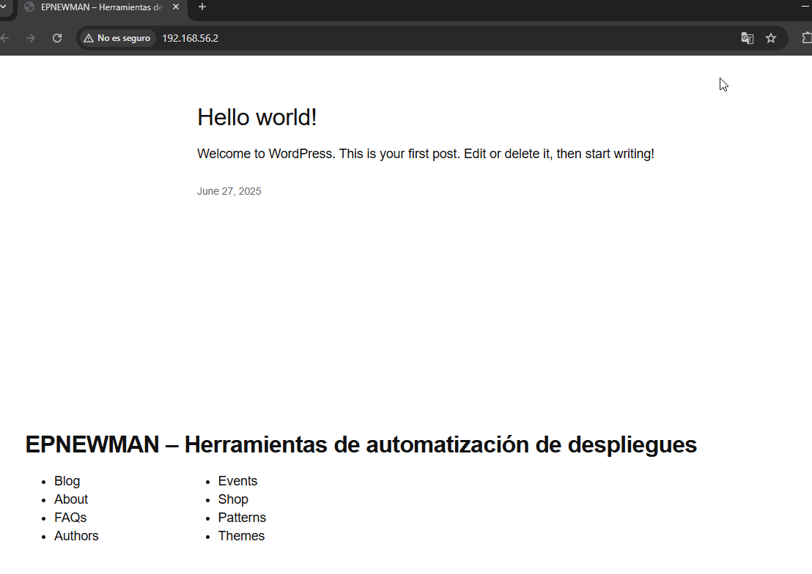

# UNIVERSIDAD PRIVADA DE TACNA  
## FACULTAD DE INGENIERÍA  
### ESCUELA DE INGENIERÍA DE SISTEMAS  

---

# EXAMEN DE UNIDAD III  
## “Plan de Auditoría de Tecnologías de la Información para DevIA360”  

> **Curso:** Auditoría de sistemas  
> **Integrante(s):** Chambilla Zuñiga, Josue  
> **Docente:** Dr. Oscar Juan Jimenez Flores  

**TACNA – PERÚ 2025**

---

## Índice

1. [Origen](#1-origen)  
2. [Información de la Entidad](#2-información-de-la-entidad)  
3. [Denominación de la Materia de Control](#3-denominación-de-la-materia-de-control)  
4. [Alcance](#4-alcance)  
5. [Objetivos](#5-objetivos)  
6. [Procedimientos de Auditoría](#6-procedimientos-de-auditoría)  
7. [Plazo de la Auditoría y Cronograma](#7-plazo-de-la-auditoría-y-cronograma)  
8. [Criterios de Auditoría](#8-criterios-de-auditoría)  
9. [Información Administrativa](#9-información-administrativa)  
10. [Documento a Emitir](#10-documento-a-emitir)  
11. [ANEXOS](#11-anexos)  
    - [11.1. Preparación del Entorno](#111-preparación-del-entorno)  
    - [11.2. Visualización del WordPress](#112-visualización-del-wordpress)  
    - [11.3. Matriz de Riesgos](#113-matriz-de-riesgos)  
    - [11.4. Examen y Hallazgos](#114-examen-y-hallazgos)  

---

## 1. Origen

La presente auditoría surge a solicitud de la gerencia de DevIA360, empresa especializada en soluciones tecnológicas avanzadas, ante la identificación preliminar de riesgos críticos de seguridad y deficiencias operativas en su sistema automatizado de despliegue de aplicaciones web, específicamente en el entorno basado en Chef, Vagrant y Wordpress (repositorio: Repositorio Chef_Vagrant_Wp).

Este sistema, clave para el proceso de integración y entrega continua (CI/CD), es utilizado para garantizar entornos estandarizados y eficientes en el despliegue de servicios para clientes. No obstante, durante una revisión interna, se detectaron problemas como la exposición de credenciales, configuraciones de red no seguras, falta de registros de auditoría, uso de versiones obsoletas y ausencia de separación entre ambientes de desarrollo y producción.

Dado que estos elementos comprometen la seguridad, confiabilidad y cumplimiento normativo del sistema, se ha decidido llevar a cabo una auditoría exhaustiva, con el objetivo de evaluar, documentar y mitigar los riesgos asociados al despliegue automatizado, proponiendo mejoras y buenas prácticas alineadas con los estándares de seguridad de TI y DevOps
.

---

## 2. Información de la Entidad

- **Razón Social:** DevIA360 S.A.C.  
- **Rubro:** Servicios de TI y automatización de despliegue  
- **Tipo de organización:** Empresa privada  
- **Ubicación:** Tacna, Perú  
- **Alcance de operaciones:** Nacional (sector público y privado)

---

## 3. Denominación de la Materia de Control

Evaluación de la Seguridad, Configuración y Gestión del Sistema de Despliegue Automatizado Chef_Vagrant_Wp para entornos WordPress en DevIA360.
Esta materia de control se enfoca en analizar los componentes técnicos, operativos y de seguridad del sistema automatizado de despliegue de entornos WordPress que utiliza la empresa DevIA360. El objetivo principal es verificar la correcta implementación de prácticas seguras de configuración, protección de credenciales, segmentación de ambientes, control de versiones, y trazabilidad de procesos dentro del flujo continuo de integración y entrega (CI/CD)  

---

## 4. Alcance

La presente auditoría de Tecnologías de la Información está enfocada en evaluar el sistema de despliegue automatizado de entornos WordPress implementado por DevIA360 mediante la solución Chef_Vagrant_Wp. El análisis abarca aspectos técnicos, operativos y de seguridad, centrados en los siguientes elementos:

- Revisión del código fuente del repositorio Chef_Vagrant_Wp para identificar prácticas inseguras, configuraciones deficientes o elementos obsoletos  
- Verificación del proceso de despliegue utilizando Vagrant y Chef, desde la creación del entorno virtual hasta la puesta en funcionamiento de WordPress  
- Análisis de la configuración de red, puertos y servicios expuestos dentro de la máquina virtual generada  
- Inspección del manejo de credenciales y archivos sensibles durante la automatización del entorno.  
- Evaluación de la existencia de mecanismos de auditoría y trazabilidad durante el proceso de automatización (logs, registros, validaciones).  
- Revisión de la segmentación de ambientes (desarrollo, prueba y producción) y las políticas aplicadas para su separación.
- Identificación y documentación de riesgos que afecten la confidencialidad, integridad, disponibilidad y cumplimiento normativo del sistema.

---

## 5. Objetivos

**General:**  
Evaluar la seguridad, eficiencia y cumplimiento del sistema automatizado de despliegue de entornos WordPress implementado por DevIA360 mediante la herramienta Chef_Vagrant_Wp, con el fin de identificar riesgos críticos, vulnerabilidades técnicas y oportunidades de mejora que garanticen entornos confiables y seguros.

### Objetivos Específicos

- Verificar la correcta configuración del entorno virtualizado y su proceso de automatización utilizando Vagrant y Chef  
- Identificar y documentar posibles vulnerabilidades de seguridad en el manejo de credenciales y exposición de servicios  
- Analizar el nivel de trazabilidad y auditoría presente durante el proceso de despliegue automatizado  
- Evaluar la segmentación y control de ambientes (desarrollo, prueba, producción) en el sistema analizado  
- Elaborar una matriz de riesgos que permita valorar el impacto y la probabilidad de ocurrencia de las principales amenazas detectadas

---

## 6. Procedimientos de Auditoría

A continuación, se detallan los procedimientos técnicos aplicados para cumplir con cada uno de los objetivos específicos definidos en la auditoría:

| Objetivo Específico | Procedimientos Técnicos Aplicados |
|---------------------|-----------------------------------|
| **Verificar la correcta configuración del entorno virtualizado y su proceso de automatización** | - Clonar el repositorio y desplegar el entorno según el README desde GitHub. - Verificar si WordPress funciona correctamente dentro de la VM. - Registrar capturas de pantalla del despliegue. |
| **Identificar y documentar vulnerabilidades de seguridad** | - Analizar archivos sensibles (Vagrantfile, recipes, attributes) en busca de credenciales expuestas. - Validar si los puertos expuestos son seguros o innecesarios. - Verificar versiones obsoletas del software desplegado. |
| **Analizar el nivel de trazabilidad y auditoría** | - Comprobar si existen logs, registros o mecanismos de seguimiento del proceso de despliegue. - Verificar si Chef genera registros de ejecución o errores. |
| **Evaluar la segmentación y control de ambientes** | - Revisar si el sistema permite separar ambientes (desarrollo, prueba, producción). - Comprobar si hay variables o archivos que distingan los entornos o si todo se maneja como uno solo. |
| **Elaborar una matriz de riesgos** | - Identificar al menos cinco riesgos técnicos a partir del análisis. - Clasificar los riesgos por nivel de impacto y probabilidad. - Asociar cada riesgo con evidencia técnica documentada (fragmento de código, captura, etc.). |

---
## 7. Plazo de la Auditoría y Cronograma

A continuación se detalla el cronograma de actividades programadas para la ejecución de la auditoría del sistema Chef_Vagrant_Wp, indicando etapas, fechas y duración:

| Etapa                  | Fecha de Inicio | Fecha de Finalización | Duración (días) | Actividades Detalladas                                                                 |
|------------------------|------------------|-------------------------|------------------|----------------------------------------------------------------------------------------|
| **Planificación**       | 27/06/2025       | 28/06/2025              | 2                | Definición del alcance, objetivos, criterios y metodología de auditoría.              |
| **Preparación del entorno** | 29/06/2025       | 01/07/2025              | 2                | Clonar el repositorio, configurar Vagrant y Chef, levantar la VM, validar el entorno. |
| **Revisión técnica**    | 01/07/2025       | 04/07/2025              | 4                | Análisis del código fuente, configuraciones, credenciales, puertos, versiones.         |
| **Evaluación de seguridad** | 05/07/2025       | 06/07/2025              | 2                | Identificación de vulnerabilidades, trazabilidad y segmentación de ambientes.         |
| **Identificación de riesgos** | 07/07/2025       | 08/07/2025              | 2                | Redacción de la matriz de riesgos con evidencia técnica.                               |
| **Elaboración del informe**  | 09/07/2025       | 10/07/2025              | 2                | Redacción del informe de auditoría con hallazgos, conclusiones y recomendaciones.     |

---

## 8. Criterios de Auditoría

Los criterios de auditoría son los **principios, normas técnicas y buenas prácticas** que sirven como referencia para evaluar el sistema de despliegue automatizado de DevIA360. A continuación, se detallan los criterios asociados a cada objetivo específico:

| Objetivo Específico | Criterios de Auditoría | Fuente / Referencia |
|---------------------|------------------------|---------------------|
| **Verificar la configuración del entorno automatizado** | La configuración del entorno debe ser clara, reproducible, segura y documentada. | Infrastructure as Code Best Practices / DevOps Handbook |
| | El Vagrantfile debe restringir el acceso a puertos innecesarios o inseguros. | OWASP Deployment Best Practices / CIS Benchmarks |
| **Identificar vulnerabilidades de seguridad** | Las credenciales no deben estar en texto plano; deben gestionarse mediante herramientas seguras (Chef Vault, HashiCorp Vault, etc.). | OWASP Secure Configuration / ISO/IEC 27001 A.9 (Access Control) |
| | El software instalado debe estar actualizado y libre de vulnerabilidades conocidas (CVE). | NIST SP 800-40 / OWASP Dependency Management |
| **Analizar trazabilidad y auditoría** | Todo proceso automatizado debe generar registros persistentes de ejecución y errores. | ISO/IEC 27001 A.12.4 (Logging and Monitoring) |
| | Debe ser posible rastrear los cambios realizados en cada despliegue. | ITIL – Control de Cambios / DevSecOps Practices |
| **Evaluar la separación de ambientes** | El entorno debe permitir una separación clara entre desarrollo, pruebas y producción. | OWASP Deployment Controls / DevOps Handbook |
| | La configuración por entorno debe ser gestionada a través de variables, perfiles o entornos virtuales independientes. | Chef Environments Best Practices |
| **Elaborar una matriz de riesgos** | Se deben identificar riesgos con base en evidencias técnicas, y evaluarlos por impacto y probabilidad. | ISO 31000 (Gestión de Riesgos) / NIST Risk Management Framework |

---

## 9. Información Administrativa

| Cargo             | Nombre y Apellidos | Rol / Especialidad                             | Participación                                                                 |
|------------------|---------------------|------------------------------------------------|--------------------------------------------------------------------------------|
| Auditor Líder     | Josue Chambilla     | Seguridad de la Información / DevOps           | Coordinación general de la auditoría, validación de hallazgos, redacción del informe final. |
| Auditor Técnico   | Josue Chambilla     | Automatización de Infraestructura / Chef       | Análisis del código fuente, ejecución de entorno, revisión de configuraciones. |
| Auditor Asistente | Josue Chambilla     | Soporte Técnico / Evidencia Documental         | Captura de evidencias gráficas, soporte en documentación y elaboración de anexos. |

---

## 10. Documento a Emitir

Como resultado del proceso de auditoría realizado al sistema de despliegue automatizado **Chef_Vagrant_Wp** utilizado por **DevIA360**, se emitirá el siguiente documento:

### Nombre del Documento a Emitir
**Informe Técnico de Auditoría de Tecnologías de la Información sobre el Sistema Automatizado de Despliegue Chef_Vagrant_Wp en DevIA360**

### Descripción del Documento

El documento a emitir es un **informe técnico** que consolidará todos los **hallazgos, análisis, evidencias y conclusiones** obtenidas durante la auditoría realizada al sistema de despliegue automatizado utilizado por DevIA360.

Este informe tiene como objetivo principal proporcionar a la gerencia una **visión clara y detallada del estado actual del sistema**, en cuanto a su **seguridad, eficiencia, configuración, trazabilidad y cumplimiento de buenas prácticas**.

---

### Contenido Estructurado del Informe

1. **Carátula y Datos Generales**  
   Información institucional, datos de la auditoría, fecha y participantes.

2. **Origen y Justificación de la Auditoría**  
   Motivo que originó la revisión técnica, antecedentes y contexto del sistema evaluado.

3. **Objetivos de la Auditoría**  
   Objetivo general y específicos, alineados al enfoque técnico y de seguridad.

4. **Alcance de la Auditoría**  
   Límites de la auditoría, recursos evaluados y restricciones.

5. **Criterios de Evaluación**  
   Normas, estándares y buenas prácticas utilizadas como referencia técnica.

6. **Procedimientos de Auditoría**  
   Actividades desarrolladas, herramientas utilizadas y técnicas aplicadas.

7. **Cronograma de Ejecución**  
   Fechas, etapas y duración de cada fase del trabajo de auditoría.

8. **Matriz de Riesgos y Evidencias Técnicas**  
   Riesgos detectados, causas, niveles de impacto y anexos que los sustentan.

9. **Análisis y Resultados Detallados**  
   Evaluación técnica de configuraciones, credenciales, versiones de software, segmentación de entornos y registros.

10. **Recomendaciones de Mejora**  
    Propuestas de solución concretas, viables y alineadas a buenas prácticas de DevSecOps y gestión de infraestructura.

11. **Conclusiones Finales**  
    Síntesis de los hallazgos más relevantes y su impacto en la operación segura del sistema.

12. **Anexos Técnicos**  
    Capturas de pantalla, fragmentos de código, archivos de configuración, comandos ejecutados y cualquier evidencia relevante.

---

### Finalidad del Documento

Este informe técnico tiene como propósito:

- Proveer a **DevIA360** de un **diagnóstico preciso** sobre el estado actual de su sistema automatizado de despliegue.  
- Permitir la **identificación y mitigación oportuna de riesgos** técnicos y de seguridad.  
- Fomentar la adopción de **mejores prácticas** en automatización, gestión de configuraciones y control de versiones.  
- Servir como **evidencia documental** para auditorías futuras, procesos de mejora continua, certificaciones o revisiones internas.  
- Facilitar la **toma de decisiones estratégicas** por parte de la alta dirección en cuanto a seguridad de la infraestructura y cumplimiento.

## 11. ANEXOS

### 11.1 Preparación del Entorno

Primero tenemos que ir a **📂 Ubicación:** `.vagrant.d\gems\3.3.8\gems\dotenv-0.11.1\lib\dotenv.rb` donde tenemos que cambiar la palabra *"exists"* a *"exist"* como se muestra en la imagen

Despues ejecutamos instalamaos el plugin vagrant-env para poder cargar variables ed ambiente desde el archivo .env con el comando :

_(vagrant plugin install vagrant-env)_

También debes instalar la gema serverspec para poder ejecutar las pruebas de integración e infraestructura:

_(gem install serverspec)_

Para levantar las dos máquinas virtuales con Ubuntu 20.04 ejecuta el comando:

_(vagrant up)_

Tambien se puede visualizar en el Virtual Box que las maquinas virtuales se levantaron correctamente

### 11.2 Visualizar el WordPress 

Una vez que se hayan levantado todas las VMs podrás acceder a Wordpress en la página: http://192.168.56.2/ 

### 11.4. Examen y Hallazgos

### Exposición de Credenciales en Código Fuente

**📂 Ubicación:** `cookbooks/database/recipes/ubuntu.rb`

**🔍 Impacto Detallado:**
- **Seguridad:** Compromiso potencial de la base de datos por credenciales predecibles y expuestas.  
- **Datos:** Posible acceso no autorizado a información sensible de WordPress y usuarios.  
- **Cumplimiento:** Violación de estándares de seguridad (ISO 27001, GDPR).  
- **Reputacional:** Pérdida de confianza si se comprometen datos de usuarios.  
- **Financiero:** Costos asociados a la respuesta a incidentes y posibles multas por incumplimiento.  
- **Operacional:** Necesidad de cambio de credenciales en todos los sistemas si son comprometidas.  

---

### SSL/TLS Inseguro

**📂 Ubicación:** `cookbooks/proxy/templates/default/ubuntu.conf.erb`

**🔍 Impacto Detallado:**
- **Seguridad:** Vulnerabilidad a ataques Man-in-the-Middle y downgrade attacks.  
- **Cumplimiento:** Incumplimiento de requisitos PCI-DSS que prohíben TLS 1.0/1.1.  
- **Rendimiento:** Uso innecesario de protocolos obsoletos que pueden ralentizar conexiones.  
- **Compatibilidad:** Posibles problemas con navegadores modernos que rechazan protocolos antiguos.  
- **Reputacional:** Alertas de seguridad en navegadores modernos.  
- **Legal:** Posible incumplimiento de regulaciones de protección de datos.  

---

### Sin Control de Versiones

**📂 Ubicación:** `cookbooks/wordpress/recipes/ubuntu_wp.rb`

**🔍 Impacto Detallado:**
- **Estabilidad:** Riesgo de incompatibilidad entre versiones de plugins y temas.  
- **Seguridad:** Posible introducción de vulnerabilidades no probadas.  
- **Operacional:** Dificultad para realizar rollbacks en caso de problemas.  
- **Mantenimiento:** Imposibilidad de reproducir ambientes exactos.  
- **Auditoría:** Pérdida de trazabilidad de versiones desplegadas.  
- **Rendimiento:** Posibles problemas de rendimiento con versiones no probadas.  

---

### Logs No Centralizados

**📂 Ubicación:** `cookbooks/proxy/templates/default/ubuntu.conf.erb`

**🔍 Impacto Detallado:**
- **Monitoreo:** Dificultad para detectar patrones de ataque en tiempo real.  
- **Forense:** Complejidad en investigaciones post-incidente.  
- **Operacional:** Mayor tiempo de respuesta ante incidentes.  
- **Cumplimiento:** Dificultad para demostrar controles de auditoría.  
- **Eficiencia:** Tiempo excesivo en análisis de logs distribuidos.  
- **Costos:** Incremento en recursos necesarios para gestión de logs.  

---

### Sin Separación de Ambientes

**📂 Ubicación:** `Vagrantfile`

**🔍 Impacto Detallado:**
- **Seguridad:** Riesgo de exponer configuraciones de producción en desarrollo.  
- **Calidad:** Imposibilidad de garantizar pruebas en ambientes idénticos.  
- **Operacional:** Riesgo de despliegues incorrectos entre ambientes.  
- **Desarrollo:** Conflictos entre equipos trabajando en diferentes features.  
- **Costos:** Ineficiencia en uso de recursos por falta de optimización por ambiente.  
- **Mantenimiento:** Complejidad en gestión de configuraciones específicas.  

---

### Puertos Expuestos

**📂 Ubicación:** `cookbooks/proxy/recipes/default.rb`

**🔍 Impacto Detallado:**
- **Seguridad:** Exposición innecesaria de servicios a Internet.  
- **Superficie de Ataque:** Incremento en puntos de entrada potenciales.  
- **Control:** Falta de granularidad en accesos por ambiente.  
- **Monitoreo:** Dificultad para detectar accesos no autorizados.  
- **Cumplimiento:** Violación de principio de mínimo privilegio.  
- **Rendimiento:** Sobrecarga potencial por tráfico no filtrado.  

---

### Sin Gestión de Secretos

**📂 Ubicación:** `cookbooks/wordpress/attributes/default.rb`

**🔍 Impacto Detallado:**
- **Seguridad:** Exposición de información sensible en control de versiones.  
- **Gestión:** Dificultad para rotar credenciales de forma segura.  
- **Auditoría:** Falta de control sobre acceso a secretos.  
- **Cumplimiento:** Violación de políticas de gestión de accesos.  
- **Operacional:** Riesgo de fugas de información en logs y backups.  
- **Desarrollo:** Exposición de secretos en entornos de desarrollo.  
- **Legal:** Incumplimiento de regulaciones de protección de datos.  

---

### 11.3 Matriz de Riesgos  

## 11.4. Matriz de Riesgos

| Riesgo Identificado                    | Causa Específica (Evidencia Técnica / Anexo)                                                              | Nivel de Riesgo | Probabilidad de Ocurrencia (%) | Impacto                                                                                                                                  |
|----------------------------------------|------------------------------------------------------------------------------------------------------------|-----------------|-------------------------------|------------------------------------------------------------------------------------------------------------------------------------------|
| Configuración Insegura de SSL/TLS     | Soporte de protocolos TLSv1 y TLSv1.1 considerados inseguros según estándares actuales. Ubicación: `cookbooks/database/recipes/ubuntu.rb`| Medio           | 75%                           | Medio                                       |
| Ausencia de Control de Versiones de Software | Instalación no controlada de versiones que puede introducir vulnerabilidades no probadas. Ubicación: `cookbooks/proxy/templates/default/ubuntu.conf.erb`                   | Medio           | 80%                           | Medio                                   |
| Falta de Centralización de Logs       | Dificultad para monitorear y detectar incidentes de seguridad en tiempo real. Ubicación: `cookbooks/wordpress/recipes/ubuntu_wp.rb`                              | Bajo            | 60%                           | Bajo                                               |
| Ausencia de Separación de Ambientes   | Mismo código y configuración para todos los ambientes sin distinción. Ubicacion: `cookbooks/proxy/templates/default/ubuntu.conf.erb`                                     | Alto            | 85%                           | Alto              |
| Exposición de Puertos sin Restricción | Configuración permisiva de firewall sin restricciones específicas por ambiente. Ubicacion: `Vagrantfile`                           | Medio           | 70%                           |Medio                           |
| Ausencia de Gestión Segura de Secretos| Ausencia de un sistema seguro de gestión de secretos como Chef Vault o HashiCorp Vault. Ubicacion: `cookbooks/proxy/recipes/default.rb`                  | Alto            | 95%                           | Alto    |
